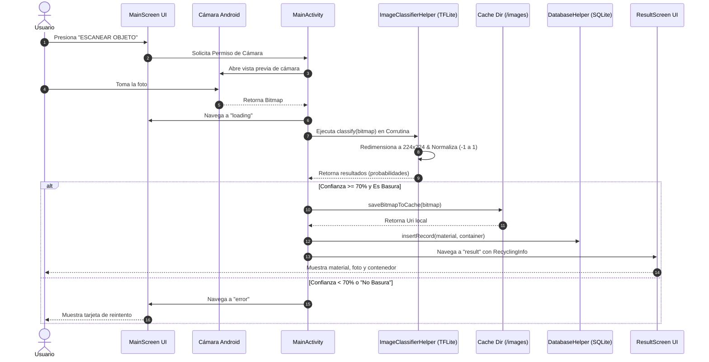

# Documentación Técnica y Explicativa del Código - Recicla+ ♻️

Este documento proporciona una guía explicativa profunda sobre el funcionamiento, arquitectura, sistema de compilación Gradle, framework UI Jetpack Compose, formato XML de recursos, librerías, gráficos vectoriales, base de datos y modelo de Inteligencia Artificial de la aplicación Android **Recicla+**.

Está diseñado como manual de referencia técnica para el equipo de desarrolladores del proyecto.

---

## 1. Visión General del Proyecto

**Recicla+** es una aplicación móvil nativa desarrollada en **Kotlin** con la interfaz declarativa **Jetpack Compose**. Su objetivo principal es facilitar la correcta separación de residuos reciclables en entornos escolares/liceanos mediante la cámara del dispositivo móvil e **Inteligencia Artificial en tiempo real**.

### Ficha Técnica
- **Lenguaje**: Kotlin 2.2.10
- **Sistema de Compilación (Build System)**: Gradle 8.x con Kotlin DSL (`.gradle.kts`)
- **Android SDK**: `minSdk = 24` (Android 7.0), `compileSdk = 35` / `targetSdk = 35` (Android 15)
- **UI Framework**: Jetpack Compose con Material Design 3 (Material You)
- **Motor IA**: TensorFlow Lite 2.17.0 (Teachable Machine classification model)
- **Base de Datos Local**: SQLite nativo (`SQLiteOpenHelper`)
- **Arquitectura de Navegación**: Single-Activity Architecture (`MainActivity`) con `NavHost` declarativo

---

### 1.1. Significado Detallado de la Configuración Android SDK (`build.gradle.kts`)

La configuración de versiones del SDK define la compatibilidad, alcance y seguridad de la aplicación en el ecosistema Android:

```kotlin
android {
    compileSdk = 35

    defaultConfig {
        minSdk = 24
        targetSdk = 35
    }
}
```

1. **`minSdk = 24` (Android 7.0 Nougat)**:
   - **¿Qué significa?**: Es el **límite inferior de compatibilidad**. Representa la versión más antigua del sistema operativo Android en la que la aplicación se puede instalar y ejecutar. Si un usuario intenta instalar Recicla+ en un dispositivo con Android 6.0 (API 23) o inferior, la Google Play Store o el instalador del sistema bloquearán la instalación.
   - **¿Por qué se eligió API 24?**: Garantiza compatibilidad con más del **98% de los dispositivos Android activos a nivel mundial**. Esto asegura que estudiantes, profesores u otros usuarios con teléfonos antiguos o de gama de entrada puedan instalar y usar la aplicación sin problemas.

2. **`compileSdk = 35` (Android 15 - Vanilla Ice Cream)**:
   - **¿Qué significa?**: Es la **versión del SDK contra la cual el compilador de Gradle procesa el código Kotlin**. Define qué APIs nativas de Android están disponibles para los desarrolladores durante el proceso de codificación.
   - **¿Por qué API 35?**: Permite utilizar las últimas optimizaciones del compilador, compatibilidad completa con Jetpack Compose 2025/2026, soporte para nuevas librerías y detección previa de funciones deprecadas (descontinuadas). *Nota: No afecta la compatibilidad con teléfonos antiguos.*

3. **`targetSdk = 35` (Android 15)**:
   - **¿Qué significa?**: Le indica al sistema operativo Android en qué versión del sistema la aplicación ha sido diseñada y probada a nivel de comportamiento en tiempo de ejecución.
   - **Importancia Técnica**: Cuando un teléfono moderno (por ejemplo con Android 14 o 15) ejecuta Recicla+, aplica las reglas de seguridad y privacidad de Android 15 (como la gestión estricta de permisos de cámara, el renderizado de pantalla completa *edge-to-edge* y la protección de carpetas en caché). Google Play exige mantener `targetSdk` actualizado para publicar y actualizar aplicaciones en la tienda.

---

## 2. El Sistema de Compilación: Gradle y su Rol en Recicla+

### 2.1. ¿Qué es Gradle y cuál es su función principal?
**Gradle** es el **sistema de automatización de compilación (Build System)** oficial del ecosistema Android.

En términos sencillos, Gradle actúa como el *"director de orquesta"* de la aplicación. Su trabajo consiste en tomar todo el código fuente escrito en Kotlin (`.kt`), los recursos XML, los íconos vectoriales, el modelo de Inteligencia Artificial (`model_unquant.tflite`), las vistas escritas en Jetpack Compose y las librerías externas para **unificarlos, procesarlos y empaquetarlos** en un archivo ejecutable descargable e instalable llamado **APK (Android Package)** o **AAB (Android App Bundle)**.

```
[ Código Kotlin (.kt) ] ──┐
[ Assets IA (.tflite) ]  ├──► ( Gradle Build Process ) ──► [ Archivo ejecutable .APK ]
[ Librerías externas  ]  │         (AAPT2 + Kotlinc)
[ Recursos / XMLs    ]  ──┘
```

---

### 2.2. ¿Cómo funciona Gradle? Las 3 Fases del Ciclo de Vida
Cada vez que presionas "Run" o "Make Project" en Android Studio, Gradle ejecuta tres fases secuenciales:

1. **Fase de Inicialización**:
   Lee el archivo `settings.gradle.kts` para identificar qué módulos forman parte de la aplicación (en Recicla+, el módulo principal es `:app`).
2. **Fase de Configuración**:
   Evalúa los archivos de construcción `build.gradle.kts` (tanto de la raíz como del módulo `:app`). En esta fase crea un **Grafo Dirigido Acíclico (DAG)** de tareas interconectadas.
3. **Fase de Ejecución**:
   Ejecuta las tareas en el orden correcto:
   - Descarga librerías remotas desde **Maven Central** y **Google Maven Repository**.
   - Compila el código Kotlin a bytecode Java (`.class`) usando el compilador `kotlinc`.
   - Transforma el bytecode a formato de máquina virtual Android (`.dex`).
   - Empaqueta los archivos de `assets` y procesa los recursos XML con `AAPT2` (Android Asset Packaging Tool).
   - Genera el APK firmado final para instalarlo en el dispositivo o emulador.

---

### 2.3. Participación Específica de Gradle en Recicla+

1. **Uso de Kotlin DSL (`.gradle.kts`)**:
   Anteriormente Gradle utilizaba el lenguaje Groovy. Recicla+ utiliza **Kotlin DSL**, lo que significa que los scripts de configuración están escritos en el propio lenguaje Kotlin, otorgando sugerencias de autocompletado en Android Studio y detección inmediata de errores de sintaxis antes de compilar.

2. **Gestión Automática de Dependencias**:
   Sin Gradle, tendríamos que descargar manualmente archivos `.jar` o `.aar` de cada librería. Gradle descarga, actualiza y resuelve conflictos de versiones automáticamente:
   ```kotlin
   dependencies {
       implementation("org.tensorflow:tensorflow-lite:2.17.0")
       implementation("io.coil-kt:coil-compose:2.6.0")
       implementation("androidx.navigation:navigation-compose:2.8.8")
   }
   ```

3. **Habilitación del Compilador de Jetpack Compose**:
   Le indica al compilador de Kotlin que active el plugin del compilador de Compose (`kotlin-compose` plugin):
   ```kotlin
   buildFeatures {
       compose = true
   }
   ```

4. **Empaquetado Intacto de la Inteligencia Artificial**:
   Gradle asegura que el modelo `model_unquant.tflite` ubicado en `app/src/main/assets/` se incluya en el paquete de la app sin compresión destructiva, permitiendo que la biblioteca de TensorFlow Lite pueda leerlo en memoria mediante mapeo de bytes (`MappedByteBuffer`) a máxima velocidad durante el escaneo.

---

## 3. El Framework UI: Jetpack Compose y el Formato XML

### 3.1. ¿Qué es XML y qué papel cumple en Android?
**XML** son las siglas de *eXtensible Markup Language* (Lenguaje de Marcado Extensible). Es un formato de texto estructurado basado en etiquetas con inicio y cierre (como `<manifest>...</manifest>` o `<string name="...">...</string>`).

Históricamente en Android, XML se usaba tanto para definir las pantallas de usuario (`layouts.xml`) como para almacenar recursos estáticos del sistema.

**En Recicla+**:
- **Pantallas de la App**: No se usan archivos XML para diseñar interfaces. Todas las pantallas se construyen dinámicamente con **Jetpack Compose en código Kotlin**.
- **Recursos Nativos del Sistema**: XML se sigue utilizando como el estándar nativo de Android para configurar los archivos de soporte ubicados en la carpeta `app/src/main/res/` y el manifiesto:
  - `AndroidManifest.xml`: Declaración de permisos de cámara, tema y Activity principal.
  - `strings.xml`: Textos y cadenas traducibles de la app.
  - `colors.xml` / `themes.xml`: Configuración básica de compatibilidad del sistema Android.
  - `ic_launcher_background.xml`: Capas vectoriales en XML para el ícono de la app.

---

### 3.2. Jetpack Compose: El Framework UI Declarativo

#### Paradigma Declarativo vs Imperativo Tradicional
- **Sistema Tradicional con XML**: Se diseñaba la pantalla estática en un archivo XML y luego en Kotlin se buscaba cada elemento con `findViewById(...)` para cambiarle el texto o el color manualmente.
- **Jetpack Compose (Declarativo en Kotlin)**: La UI se describe como funciones puras escritas en Kotlin anotadas con `@Composable`. La pantalla se redibuja automáticamente (**Recomposición**) cuando el estado de la app cambia.

```
[ Estado de la App ] ──► ( Recomposición ) ──► [ Interfaz de Usuario (UI) ]
```

---

### 3.3. Conceptos Clave de Jetpack Compose en Recicla+

1. **Funciones Componibles (`@Composable`)**:
   Son los bloques de construcción de la UI (ej. `MainScreen()`, `ResultScreen()`, `ActionButton()`).

2. **Gestión de Estado (`State` y `remember`)**:
   Utilizamos `remember { mutableStateOf(...) }` para conservar el estado de la UI (ej. tema actual, ruta de navegación, término de búsqueda).

3. **Flujo Unidireccional de Datos (UDF)**:
   El estado fluye hacia abajo (desde `MainActivity` hacia los componibles) y los eventos fluyen hacia arriba (mediante lambdas al hacer clic).

4. **Modificadores (`Modifier`)**:
   Encadenamiento modular de estilos, tamaños, bordes, transparencias y gestos:
   ```kotlin
   modifier = Modifier
       .fillMaxWidth()
       .height(56.dp)
       .clip(RoundedCornerShape(28.dp))
       .background(colorScheme.primary)
   ```

5. **Material Design 3 (Material You)**:
   Uso de componentes estandarizados como `Scaffold`, `CenterAlignedTopAppBar`, `ModalNavigationDrawer`, `Card`, `Button`, `OutlinedTextField` y `Surface`.

6. **Arquitectura Single-Activity**:
   Toda la aplicación se ejecuta dentro de un único contenedor nativo (`MainActivity`), delegando el cambio de pantallas al componente `NavHost`.

---

## 4. Librerías Utilizadas y Justificación Técnica

A continuación se detalla cada dependencia configurada en el archivo `app/build.gradle.kts` y el motivo de su elección:

| Librería / Dependencia | Versión / Tipo | Justificación y Propósito en el Proyecto |
| :--- | :--- | :--- |
| `androidx.compose.material3` | Material 3 | Proporciona los componentes visuales nativos de última generación (Tarjetas, Botones, `Scaffold`, `TopAppBar`, `ModalNavigationDrawer`). |
| `androidx.navigation:navigation-compose` | 2.8.8 | Permite la navegación sin fragmentos antiguos. La navegación se define como un grafo de composables (`NavHost`), reduciendo el consumo de memoria y facilitando la transferencia de estado. |
| `io.coil-kt:coil-compose` | 2.6.0 | Biblioteca de carga asíncrona de imágenes optimizada para Compose. Se utiliza en `ResultScreen` para renderizar la foto tomada por la cámara desde el almacenamiento en caché sin congelar la interfaz de usuario. |
| `org.tensorflow:tensorflow-lite` | 2.17.0 | Motor C++ ligero para la ejecución de modelos de aprendizaje automático en dispositivos móviles sin necesidad de conexión a internet. |
| `org.tensorflow:tensorflow-lite-support` | 0.5.0 | Proporciona utilidades para manejar tensores e imágenes (`ImageProcessor`, `TensorImage`, `NormalizeOp`, `TensorBuffer`), eliminando la necesidad de procesar arreglos de bytes de forma manual. |
| `androidx.compose.material:material-icons-extended` | Extended Icons | Proporciona un catálogo completo de íconos vectoriales dinámicos (`Eco`, `Spa`, `Recycling`, `CameraAlt`, `History`, `Settings`, etc.). |
| `androidx.core:core-splashscreen` | 1.2.0 | Administra la pantalla de carga de inicio nativa requerida en versiones modernas de Android (Android 12+). |
| `androidx.lifecycle:lifecycle-runtime-ktx` & `viewmodel-compose` | 2.10.0 / 2.6.1 | Ofrece soporte para Corrutinas ligadas al ciclo de vida (`lifecycleScope`, `rememberCoroutineScope`) para operaciones asíncronas pesadas como la clasificación de imágenes y la lectura de SQLite. |

---

## 5. Arquitectura Visual, Gráficos Vectoriales y Diseño UI

### Gráficos Vectoriales (`ImageVector` vs XML)
En lugar de depender exclusivamente de imágenes PNG o JPG estáticas que aumentan el tamaño de la APK y se pixuelan en pantallas de alta resolución, Recicla+ utiliza **Gráficos Vectoriales Nativos**:

1. **Vectores Compose (`ImageVector`)**: Iconos como `Icons.Default.Eco`, `Icons.Default.Spa` y `Icons.Default.Recycling` son matemáticamente representados como rutas (paths).
   - **Ventajas**: Escala infinita sin pérdida de nitidez, cero peso en memoria de texturas y posibilidad de alterar el color dinámicamente (`tint`).
2. **Adornos Decorativos en Código**: En pantallas como `MainScreen`, `DevelopersScreen` y `HowToUseScreen`, se renderizan hojas ecológicas de fondo mediante:
   ```kotlin
   Icon(
       imageVector = Icons.Default.Eco,
       contentDescription = null,
       tint = colorScheme.secondary.copy(alpha = 0.2f),
       modifier = Modifier
           .size(120.dp)
           .align(Alignment.CenterStart)
           .offset(x = (-40).dp, y = (-150).dp)
   )
   ```
   *Esto crea capas de profundidad orgánica sin recargar el rendimiento.*

3. **Sistema de Colores Sostenible (`ui/theme/Color.kt` y `Theme.kt`)**:
   - `DarkGreen` (`#2D6A4F`): Verde institucional ecológico para barras superiores y botones primarios.
   - `LightGreen` (`#74A15E`): Verde claro para acentos y estados secundarios.
   - `AppBackground` (`#F1F7ED`): Fondo suave no cansino para la vista.
   - `RecyclingYellow` (`#FFD60A`), `RecyclingBlue` (`#0077B6`), `RecyclingBrown` (`#6D4C41`): Colores estándar universales para los contenedores de recolección.
   - **Soporte de Tema Claro y Oscuro**: Implementado en `ReciclaTheme` asociando esquemas `lightColorScheme` y `darkColorScheme`.

---

## 6. Estructura de Módulos y Carpetas

```
Recicla/
├── build.gradle.kts (Raíz del proyecto)
├── settings.gradle.kts
└── app/
    ├── build.gradle.kts (Módulo principal)
    └── src/
        └── main/
            ├── AndroidManifest.xml (Permisos y declaración de MainActivity)
            ├── assets/
            │   ├── model_unquant.tflite (Modelo TensorFlow Lite)
            │   └── labels.txt (Etiquetas de clasificación)
            ├── res/
            │   ├── drawable/ (app_logo.png, info_bg.png, vectores XML)
            │   └── values/ (colors.xml, strings.xml, themes.xml)
            └── java/com/example/recicla/
                ├── MainActivity.kt (Entry point, Navegación y Control de Permisos)
                ├── DatabaseHelper.kt (Gestión SQLite del historial de escaneos)
                ├── ImageClassifierHelper.kt (Procesador TFLite y clasificación de imágenes)
                ├── MainScreen.kt (Pantalla de inicio y menú principal)
                ├── ResultScreen.kt (Resultado del escaneo y tipo de contenedor)
                ├── ErrorScreen.kt (Pantalla de descarte / fallo en clasificación)
                ├── LoadingScreen.kt (Animación de análisis con Corrutinas)
                ├── HistoryScreen.kt (Historial guardado con opciones CRUD)
                ├── MaterialLibraryScreen.kt (Catálogo de categorías de material)
                ├── MaterialDetailScreen.kt (Manual educativo por tipo de residuo)
                ├── InfoScreen.kt (Guía informativa de contenedores)
                ├── HowToUseScreen.kt (Instrucciones para escanear correctamente)
                ├── SettingsScreen.kt (Ajustes de tema, caché y tutorial)
                ├── DevelopersScreen.kt (Créditos del equipo de desarrollo 4°E)
                ├── PointsScreen.kt (Sección de almacenamiento/puntos cercanos)
                └── ui/theme/
                    ├── Color.kt (Definición de constantes de color)
                    ├── Theme.kt (Configuración de MaterialTheme claro/oscuro)
                    └── Type.kt (Jerarquía tipográfica)
```

---

## 7. Análisis Técnico Explicativo de Archivos Clave

### A. `MainActivity.kt`
Es el **orquestador central** de la aplicación.
- **Permisos de Cámara**: Solicita el permiso `android.permission.CAMERA` mediante `rememberLauncherForActivityResult(ActivityResultContracts.RequestPermission())`.
- **Captura de Foto**: Ejecuta `ActivityResultContracts.TakePicturePreview()`, el cual entrega un objeto `Bitmap` liviano.
- **Inferencia en Segundo Plano**: Al recibir la foto, navega temporalmente a la ruta `"loading"` y lanza una Corrutina en Compose:
  ```kotlin
  scope.launch {
      delay(1200) // Retardo artificial para mostrar la animación
      val results = classifier.classify(bitmap)
      if (results.isNotEmpty() && results[0].score >= 0.70f) {
          // Si el score >= 70% y la etiqueta no es "no basura", se procesa
      } else {
          // De lo contrario se navega a "error"
      }
  }
  ```
- **Almacenamiento de Caché Privada (`saveBitmapToCache`)**:
  Para evitar contaminar la galería pública del usuario con fotos instantáneas de basura, el método guarda la foto capturada en `context.cacheDir/images`.
- **Mapeador de Contenedores (`getRecyclingInfo`)**:
  Normaliza la etiqueta arrojada por la IA (removiendo acentos y convirtiendo a minúsculas) y devuelve una estructura de datos `RecyclingInfo` con el nombre del objeto, el contenedor correspondiente (Amarillo, Azul, Verde, Marrón) y su color oficial.

---

### B. `ImageClassifierHelper.kt`
Encargado del enlace directo con **TensorFlow Lite**.

1. **Carga del Modelo**:
   Carga `model_unquant.tflite` desde la carpeta `assets` mediante `FileUtil.loadMappedFile`.
2. **Preprocesamiento del Bitmap**:
   - Redimensiona la foto del usuario a las dimensiones requeridas por el modelo (típicamente **224x224** píxeles): `Bitmap.createScaledBitmap(bitmap, 224, 224, true)`.
   - **Normalización de Píxeles**: El modelo no cuantizado espera un rango numérico entre `-1.0` y `1.0`. Mediante `NormalizeOp(127.5f, 127.5f)`, la biblioteca aplica la fórmula:
     $$\text{Píxel Normalizado} = \frac{\text{Píxel} - 127.5}{127.5}$$
3. **Ejecución del Intérprete**:
   `interpreter?.run(tensorImage.buffer, outputBuffer.buffer.rewind())` ejecuta el modelo y llena el buffer de salida con las probabilidades para cada una de las clases configuradas en `labels.txt` (`Plástico`, `Papel`, `Vidrio`, `Metal`, `Orgánico`, `No Basura`, `Cartón`).
4. **Ordenamiento de Resultados**: Devuelve la lista ordenada en forma descendente según la puntuación de confianza (`score`).

---

### C. `DatabaseHelper.kt`
Gestiona la persistencia local de datos con **SQLite nativo** mediante `SQLiteOpenHelper`.

- **Tabla `history`**:
  - `id`: INTEGER (Clave primaria autoincrementable)
  - `material`: TEXT (Nombre del residuo detectado)
  - `container`: TEXT (Contenedor asignado)
  - `date`: TEXT (Fecha y hora con formato `"dd/MM/yyyy HH:mm"`)
  - `note`: TEXT (Nota personalizada escrita por el usuario)

- **Operaciones CRUD Implementadas**:
  - **Create**: `insertRecord(material, container)` -> Registra automáticamente el escaneo tras ser verificado por la IA.
  - **Read**: `getAllRecords()` -> Devuelve todos los elementos ordenados del más reciente al más antiguo (`ORDER BY id DESC`).
  - **Update**: `updateNote(id, newNote)` -> Permite al usuario adjuntar o modificar una nota personalizada desde la pantalla de historial.
  - **Delete**: `deleteRecord(id)` -> Elimina un registro puntual del historial.

---

### D. Resumen de Pantallas Compose (Interfaz de Usuario)

1. **`MainScreen.kt`**: Pantalla de inicio con menú lateral (`ModalNavigationDrawer`), barra de búsqueda con validación estricta (solo letras y espacios), accesos directos principales y el "Consejo del Día".
2. **`ResultScreen.kt`**: Muestra la foto real del objeto procesado con `AsyncImage` de Coil, el tipo de residuo detectado, la tarjeta de contenedor con colores de alto contraste y consejos sobre cómo reciclar.
3. **`ErrorScreen.kt`**: Se muestra cuando la IA detecta que el objeto no es reciclable o cuando la certeza es inferior al 70%. Ofrece sugerencias de iluminación y encuadre.
4. **`LoadingScreen.kt`**: Muestra un indicador circular verde con el icono de reciclaje girando continuamente mediante `rememberInfiniteTransition()`.
5. **`HistoryScreen.kt`**: Muestra la lista `LazyColumn` de escaneos pasados, permitiendo editar notas mediante un `AlertDialog` o borrar elementos.
6. **`MaterialLibraryScreen.kt` & `MaterialDetailScreen.kt`**: Biblioteca educativa interactiva dividida en cuadrícula para aprender sobre el reciclaje de Plástico, Papel, Cartón, Vidrio, Metal y Orgánicos.
7. **`InfoScreen.kt`**: Guía educativa general sobre el uso de contenedores e ítems no reciclables o prohibidos.
8. **`HowToUseScreen.kt` (Tutorial Gamificado de Dopamina)**: Diseñado como la primera pantalla de inducción/onboarding para enganchar visualmente al usuario. Cuenta con un **Hero Banner en gradiente con microanimaciones de pulso (`rememberInfiniteTransition`)**, un **Badge de Nivel Eco (`Héroe del Planeta 🌿`)**, un **indicador numérico de pasos completados (3/3)**, tres tarjetas paso-a-paso diferenciadas por color de acento (Verde Esmeralda para limpieza, Azul Cielo para fondo claro y Naranja Ambarino para enfoque y luz) con badges destacados (`¡IMPORTANTE!`, `CLARIDAD TOTAL`, `LUZ PERFECTA`), una tarjeta de **Pro-Tip de IA** con emoji dorado y un botón principal de acción gigante con ícono de verificación ("¡ENTENDIDO, A RECICLAR! 🚀").
9. **`SettingsScreen.kt`**: Pantalla de opciones que incluye cambio de tema (Claro, Oscuro, Sistema), vaciado de la caché de fotos temporales, activación de tutoriales al inicio y envío de comentarios por correo.
10. **`DevelopersScreen.kt`**: Pantalla de créditos con la lista del equipo de estudiantes desarrolladores de 4°E.
11. **`PointsScreen.kt`**: Pantalla informativa para la futura integración de mapa de centro de acopio.

---

## 8. Flujo del Ciclo de Vida del Escaneo

El siguiente diagrama en formato Mermaid explica la secuencia de ejecución cuando el usuario escanea un objeto:



---

## 9. Puntos de Extensión del Código

Para nosotros los desarrolladores, aquí están los puntos clave de entrada para modificar o extender la aplicación:

### 1. Reemplazar o Actualizar la IA
1. Reemplazar `model_unquant.tflite` y `labels.txt` en `app/src/main/assets/`.
2. Actualizar el mapeador `getRecyclingInfo(...)` en `MainActivity.kt` con las nuevas categorías.

### 2. Agregar Nuevas Pantallas
1. Crear el `@Composable` deseado.
2. Registrar el endpoint en `NavHost` dentro de `MainActivity.kt`.

### 3. Modificar la Persistencia
1. Modificar la estructura de la tabla en `DatabaseHelper.kt`.
2. Incrementar la versión `DATABASE_VERSION` para forzar la actualización de la base de datos local.

---

## 10. Mini Resumen Técnico (Síntesis del Informe)

> **Nota para el equipo de desarrollo**: Este resumen ofrece una visión panorámica de alto nivel. Para comprender la implementación exacta y los algoritmos, se debe consultar cada sección del informe y su archivo fuente correspondiente en Android Studio.

- **Pila Tecnológica Central**: Kotlin 2.2 + Jetpack Compose (Material Design 3) en arquitectura Single-Activity (`MainActivity.kt`).
- **Build System**: Gradle 8.x con Kotlin DSL (`.gradle.kts`), configurado con `minSdk = 24` (Android 7.0+) y `compileSdk`/`targetSdk = 35` (Android 15).
- **Inteligencia Artificial**: TensorFlow Lite (`model_unquant.tflite` + `labels.txt`) ejecutado en segundo plano con Corrutinas y preprocesamiento de tensores mediante `NormalizeOp(127.5f, 127.5f)`.
- **UI & Recursos Nativos**: Vistas declarativas reusables en Kotlin; archivos XML restringidos a la configuración nativa del sistema (`AndroidManifest.xml`, `strings.xml` e íconos estáticos).
- **Onboarding / Tutorial**: `HowToUseScreen.kt` rediseñada con efectos visuales de alta dopamina (gradiente interactivo, animación de pulso, badge "Nivel Eco: Héroe del Planeta", tarjetas numeradas con acentos cromáticos individuales y Pro-Tip animado de IA).
- **Persistencia & Caché**: Registro de historial con SQLite nativo (`DatabaseHelper.kt`) y almacenamiento privado de fotos en `context.cacheDir/images`.
- **Navegación**: 12 pantallas Compose conectadas con `NavHost` declarativo, soporte para temas Claro/Oscuro y gráficos vectoriales nativos (`ImageVector`).

---
*Documento preparado como referencia técnica del equipo de desarrolladores de Recicla+.*
